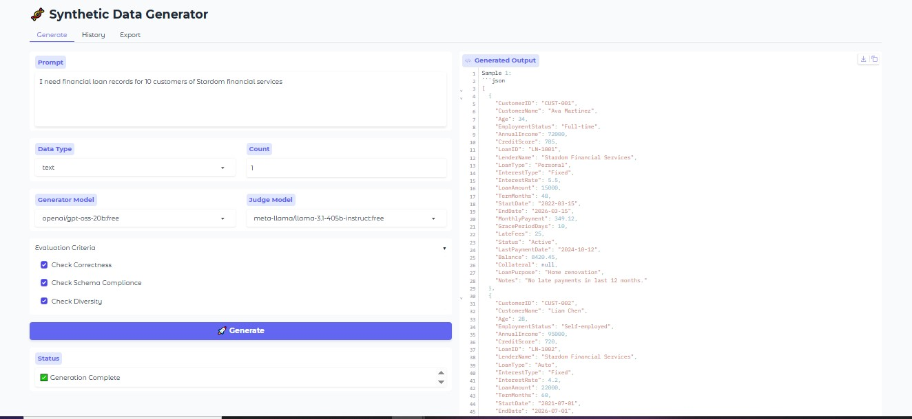

# 🧬 Synthetic Data Generator

> **A production-grade, multi-agent platform for generating, validating, and refining high-quality synthetic datasets.**




## 📖 Overview

The **Synthetic Data Generator** is an advanced tooling solution designed to solve the data scarcity problem in modern AI development. Unlike simple prompt-based generators, this platform employs a **Multi-Agent Architecture** to ensure that every generated data point meets strict quality, correctness, and schema compliance standards.

By orchestrating specialized agents, a **Generator**, a **Judge**, and a **Refiner** the system autonomously critiques and improves its own output before presenting it to the user. This "Human-in-the-Loop" optional workflow allows for the rapid creation of robust datasets for fine-tuning LLMs, testing software edge cases, or populating demos.

## ✨ Key Features

-   **🤖 Agentic Workflow**: Implements a self-correcting loop where a *Generator Agent* drafts data, a *Judge Agent* critiques it, and a *Refiner Agent* iteratively improves it.
-   **🔌 Multi-Model Support**: Seamlessly swap between top-tier models (Llama 3, Mistral, DeepSeek, Qwen) via the OpenRouter API to optimize for cost vs. quality.
-   **🛡️ Automated Validation**: Built-in strict JSON schema validation and logical correctness checks defined by the user.
-   **📊 Diverse Output Formats**: Supports JSON, Pandas DataFrames (Tabular), CSV, and raw Text/Reasoning chains.
-   **💾 Persistence Layer**: automatically archives all generation runs, prompts, and evaluation scores to a local SQLite database for auditability.
-   **🖥️ Interactive UI**: A clean, modern Gradio interface for easy configuration, visualization, and export.

## 🏗️ Architecture

The system is built on a modular architecture designed for extensibility:

1.  **Core Layer**: Contains the Agent definitions (`Generator`, `Refiner`, `Judge`) and Pydantic schemas.
2.  **LLM Abstraction**: A unified client handling disparate API providers (OpenAI, Google, DeepSeek, etc.) with automatic retry logic and rate limiting.
3.  **Application Layer**: Manages state, database sessions, and UI logic.
4.  **Memory**: Uses SQLAlchemy to persist complex hierarchical data (Runs -> Samples -> Feedback).

## 🚀 Getting Started

### Prerequisites

-   Python 3.12+
-   `uv` (recommended) or `pip`
-   An OpenRouter API Key

### Installation

1.  **Clone the repository**:
    ```bash
    git clone https://github.com/yourusername/synthetic-data-generator.git
    cd synthetic-data-generator
    ```

2.  **Install dependencies**:
    ```bash
    uv sync
    # OR
    pip install -r requirements.txt
    ```

3.  **Configure Environment**:
    Create a `.env` file in the root directory:
    ```env
    OPENROUTER_API_KEY=sk-or-v1-your-key-here
    ```

### Usage

1.  **Launch the Application**:
    ```bash
    uv run python -m app.main
    ```

2.  **Access the UI**:
    Open your browser to `http://127.0.0.1:7860`.

3.  **Generate Data**:
    -   Select your desired **Generator** (e.g., *Mistral Small*) and **Judge** (e.g., *Llama 3 405B*).
    -   Define your prompt and schema.
    -   Click **Generate** to watch the agents work in real-time.

## 🛠️ Technology Stack

-   **Language**: Python
-   **Interface**: Gradio
-   **LLM Orchestration**: OpenRouter API, OpenAI SDK
-   **Data Validation**: Pydantic
-   **Database**: SQLite, SQLAlchemy
-   **Package Management**: uv

---

## ✅ Verification Status
**Tested on:** 2026-01-31
**Status:** Success
**Configuration:**
- OpenRouter API: Configured
- Generator: Mistral Small (mistralai/mistral-small-3.1-24b-instruct:free)
- Judge: Llama 3.1 405B (meta-llama/llama-3.1-405b-instruct:free)
- UI: Operational on http://127.0.0.1:7860

---
*Princewill.*
